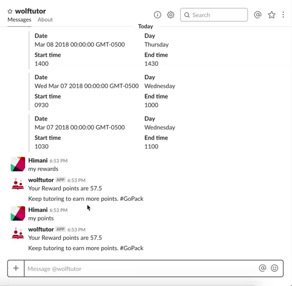
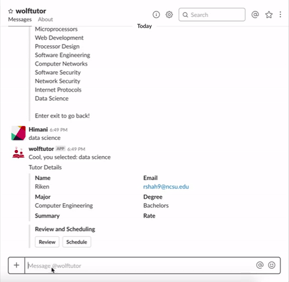
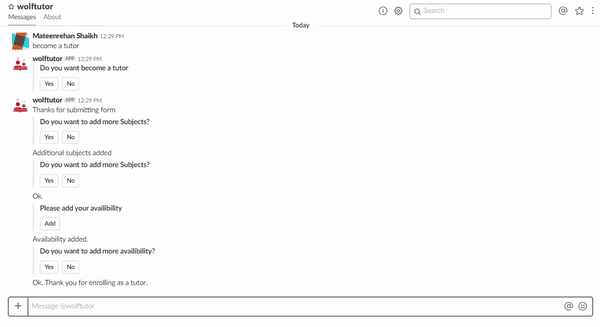

# WolfTutor [](https://travis-ci.org/rikenshah/WolfTutor)
Software Engineering Spring 2018 project

### Problem Statement

We present a peer to peer collaborative tutoring system that is based on peer reviews and rewards earned through tutoring. According to our preliminary studies, the current proportion of students who need outside tutoring for clarifications of conceptual doubts, is considerable. A platform designed for students where they can help each other to clear such doubts and help them perform better would be much appreciated. Although students have many resources available in the university like open office hours of TA, professor, etc. , still many students hesitate to ask TA/Professor the doubts and queries that they have. Also, they are more comfortable in asking silly doubts to their peers without the fear of losing marks. Hence, the system to facilitate this process and maintained by students themselves would create a positive impact in the campus community.

### Goals

1. Rewards based system which enhances knowledge sharing among NC state students.
2. Provide high quality tutoring through the platform that we build which will help students clear their concepts and succeed in the course.
3. Tutors will get experience of teaching and will increase their confidence and will enhance their subject skills.
4. A review and rating based system to maintain credibililty of tutoring provided, tutee can see reviews and ratings prior to booking a tutor.
5. Tutors can share their success tips which can help student excel in that particular course.


### Bot's description

We have created a Slack application that can be added to any Slack workspace. We have designed various user query flows with which the user can interact with the application. We have hosted our backend on NodeJS server and for frontend we are using various Slack components like dialog boxes, message menus and other interactive elements. Instead of using the traditional text based chat interface for user interaction, we figured, using interactive elements it becomes easier for user to communicate thoughts more effectively while having full control over the flow of the application.

### Steps to Install and Run (Developer Guide)

1. Make sure `Node.JS` is installed and is working in your machine. (Check using `node -v`).
2. Install `MongoDB` and start the server.
3. Make sure you have a [Slack app](https://api.slack.com/slack-apps) up and running. You will need the various tokens for `.env` file. Note the workspace that you used to make the slack app. Find your application's details at slack API home --> your apps --> (your app).
4. Make sure you have a Bot User enabled in your new slack app.
5. Add the following permissions to your app at OAuth & Permissions --> Scopes
<list>
Add a bot user with the username @bot
Post to specific channels in Slack	
Access user’s public channels
Access information about user’s public channels
Send messages as Test App
Send messages as user
Access content in user’s private channels
Access content in user’s direct messages
Access information about user’s direct messages
Modify user’s direct messages
Access your workspace’s profile information
View email addresses of people on this workspace
</list>

6. Clone the repo, using `git clone https://github.com/NCSU-CSC510-Group-E/WolfTutor.git`.
7. Download node packages using `npm install && npm update`.
8. Rename `.env.example` to `.env`.
9. Add appropriate tokens in `.env`. The four things you will need are,
```
SLACK_ACCESS_TOKEN='Enter your slack access token here'
PORT=3000
SLACK_VERIFICATION_TOKEN='Enter your slack app verification token'
BOT_TOKEN='Enter your bot token here'
MONGO_CONNECTION_STRING='Enter your mongo db url'
```

SLACK_ACCESS_TOKEN can be found at Features --> OAuth & Permissions --> OAuth Access Token
SLACK_VERIFICATION_TOKEN can be found at Basic Information --> App Credentials (Section) --> Verification Token
BOT_TOKEN can be found at Features --> OAuth & Permissions --> Bot User OAuth Access Token
MONGO_CONNECTION_STRING should be 'mongodb://localhost:27017', unless you choose a different port

10. Use Mongo's Compass Community program to connect to the currently running server. Add a table, 'subjects' to already existing 'admin' database. Add at least one item to that table as name: 'subject'. These are the tutoring subjects the users can choose from.
11. Run the tests by using `npm test`.
12. Start the application by typing `npm start`. This will start the server at `localhost:3000`.
13. Now, since you are runnning a server locally, we need a tunneling service like `ngrok` to tunnel requests sent from slack to localserver.
14. Start the tunnel using `ngrok http 3000` ([see documentation](https://ngrok.com/docs)). This will start the service and tunnel the traffic from slack to localurl. Note the `http://<something>.ngrok.io` url when you start the service.
15. Add the `ngrok url` that you noted in previous step under
    `Interactive Elements` settings in Slack App settings. This will
    tell slack where to send the post request.  Don't forget to add
    /message to the end of the URL for the REST API to work
16. Reinstall the app to your workspace. And start communicating with the app via direct messages.

### General flow of the application

- There are two types of uses in the system, tutors and students. (They can be overlapping).
- Anyone can enroll in the system by choosing so after saying `hi`. Note that all the communication is done with the `WolfTutor` bot.
- Anyone can enroll in the system by saying `become a tutor` and following further instructions.
- Students can `find a tutor` and `book a tutor` and make a reservation. This will also notify the tutor that the reservation is made. (Also, it can send email notification as per slack settings of that tutor).
- Tutoring session is done offline (or online maybe on skype of hangout).
- On reservation of the session, the points are deducted automatically from the student account and added to the tutor account
- After the session the student can give review to the tutor, which will be added to tutor profile and later visible to all students.
- There are bunch of other features, for details see usecases point #5.

### Use Cases

The four major use cases of our application are,
#### 1. Find a tutor
<Details>
<p> A user can find a tutor on our bot by just typing one of the following keywords,
'find a tutor',
'need a tutor',
'want a tutor', or
'select a tutor'.
The user will get the list of all the available subjects from which the user can select one subject.
Once a subject is selected we will be returning all the tutors who teach that subject.
</p>
Here is the flow demonstrating this use case.<br>
</img>
</Details>

#### 2. Book a tutor
<Details>
<p>   Once the user finds the tutors who are teaching that subject then the user will have an option to see the reviews and rating of tutors and can book the tutor if he has enough points in his account.</p>
<p> Once the session is booked the tutor will be notified of the reservation and both of them can see their reservation by typing 'My reservation' in the slack bot.</p>
Here is the flow demonstrating this use case.<br>
</img>
</img>
</Details>

#### 3. Become a tutor

<Details>
<p> If a user wants to become a tutor, he/she will just type
'become a tutor'
and an interactive form will be displayed to the user where he will be asked to fill his availability, subjects he would like to teach, rate which he would like to charge, summary. Once he fills all this information a profile of the tutor is created.
</p>
Here is the flow demonstrating this use case.<br>
</img>
</Details>

#### 4. Reward and Review the tutor

<Details>
<p> After the session is over the user(student) will have an option to review and rate the tutor.
If the user wil type 'review' a review form will open and the user can rate the tutor and can write a review,
so that the other users(students) can see the reviews and select the tutor.
The tutor can also set his rates according to the reviews that he gets.
We also have an option of keeping the rate to 0 for the tutors who want to teach for free.
<br><br>
All the users(tutors and students) of our system can check their rewards(points) by simply asking the bot one of the following. <br>
`My points`,`rewards`,`get my rewards`,`view my rewards` and the bot will show them their current points.<br><br>
Tutor can get rewards for his accumulated points, some of the rewards for WolfTutor points are as follows. <br>
1. Get $15 Giftcard of wolfoutfitter for 300 points.<br>
2. Get $30 Giftcard of wolfoutfitter 500 points.<br><br>
Tutee can also buy points in case his points get over, policies for buying rewards are :- <br>
1. Get 200 points for $25 <br>
2. Get 500 points for $40  <br>
3. Get 1000 points for $80  <br><br>
Here is the flow demonstrating this use case.<br>
</img>
</p>
</Details>

#### 5. List of all usecases

Here is a list of all possible commands that you can try out with the WolfTutor app.
<br>
- For enrolling in the system or viewing this list anytime, type `hi`
- If you want to find a tutor type `find a tutor`
- If you want to Become a tutor in our system type `become a tutor`
- If you want to view your review a session type `review`
- If you want to view your rewards type `rewards`
- If you want to check your availability type `my availability`
- If you want to check the subjects you are teaching type `my subjects`
- If you want to check your reservations type `my reservations`
- If you want to know how to redeem your rewards type `redeem`
- If you want to buy points type `buy`

### Architectural Design


### Design Methodologies and Patterns

We have used agile practices throughout. We used kanban project integration with github to track our progress. Here are some screenshots.

**Before**


**After**


### Reports

1. [Feb 1 report](https://github.com/rikenshah/WolfTutor/blob/master/Reports/Report_Feb/team_l_wolftutor_feb_report.pdf)

### Team Information

[Riken Shah](https://github.com/rikenshah)<br>
[Mateenrehan Shaikh](https://github.com/mateenrehan)<br>
[Himani Himani](https://github.com/hhimani)<br>
[Aaroh Gala](https://github.com/AarohGala)<br>

TA/Mentor : [Ken Tu](https://github.com/HuyTu7)<br>
Professor : [Tim Menzies](https://github.com/timm)<br>
